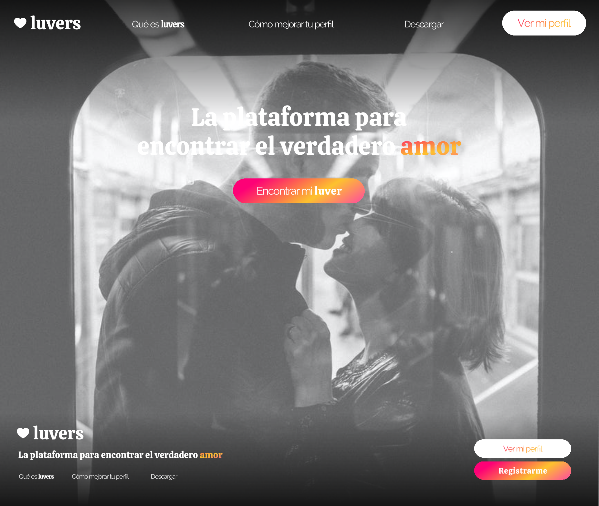

# Proyecto luvers
 luvers - 29/06/2022

#Proyecto luvers para lenguaje de marcas

## Objetivo

- Aplicar conceptos de maquetación web con HTML y darles estilo con CSS.

- Aplicar conceptos de UI/UX.

- Aprender a usar GitHub / GitHub Desktop.

### Consideraciones

1. He creado un mapa de navegación en FIGMA de la landing page de mi web:

El cual difiere bastante del resultado final de la web, habiendo hecho algunos cambios de cara a las especificaciones dadas.

2. He creado, mediante FIGMA, un logo para la web:

3. He creado una jerarquía visual y utilizado distintas fuentes (Quando y Judson).

4. He seleccionado tres colores como paleta de colores: #FFF, #80808033 y un gradiente de colores #EF4765, #FF9A5A.

5. He utilizado una rejilla de 12 columnas para la versión escritorio,  salvo en bajas resoluciones utilizando Flexbox con ordenación por filas.

6. He escrito descripciones a cada una de las imágenes para que sean accesibles a través del narrador de pantalla.

7. He prescindido del sidebar para hacer la web más limpia y simple.

8. He incluido las páginas "Experiencias de luvers", "Qué es luvers" y "Sobre nosotros" al index para hacerlo más visual y atractivo.

9. He incluido en la página de registro un formulario con distintos elementos.

10. He añadido al logo, enlaces del header y footer distintas animaciones.

11. He añadido una animación en loop al carrusel de imágenes que se detiene al colocar el cursor sobre éste.

11. He eliminado el carrusel de imágenes para bajas resoluciones y he cambiado el fondo del header del index para hacerlo más atractivo.